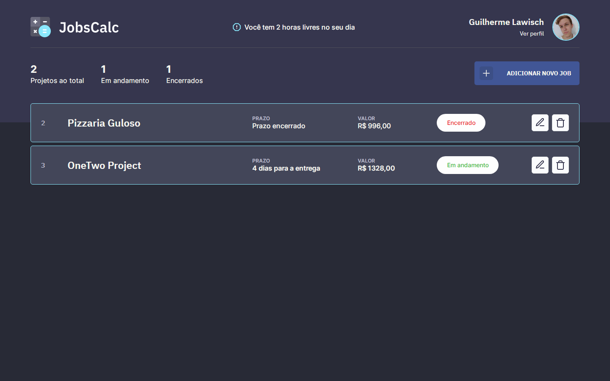

<h1 align="center">
  
</h1>

<p align="center">
  <a href="#-tecnologias">Tecnologias</a>&nbsp;&nbsp;&nbsp;|&nbsp;&nbsp;&nbsp;
  <a href="#-projeto">Projeto</a>&nbsp;&nbsp;&nbsp;|&nbsp;&nbsp;&nbsp;
  <a href="#-layout">Layout</a>&nbsp;&nbsp;&nbsp;|&nbsp;&nbsp;&nbsp;
  <a href="#memo-licença">Licença</a>
</p>

<p align="center">
 

  
</p>

<br>

## 🚀 Tecnologias

Esse projeto foi desenvolvido com as seguintes tecnologias:

- HTML
- CSS
- JavaScript / TypeScript
- NodeJS
- EJS
- Express
- TypeORM
- MySQL

## Como utilizar

Clone o projeto e acesse a pasta

`$ git clone https://github.com/GuilhermeLawisch/maratona-discovery-02-ts.git && cd maratona-discovery-02-ts`

- Crie um banco de dados 
O projeto está configurado para utilizar como padrão MySQL, com o nome do banco de dados "jobscalc"
Você pode utilizar outro banco de dados, basta trocar as configurações no arquivo ormconfig.json

Com o banco de dados ja criado, siga os passos abaixo
```
# Instalar a pasta node_modules, onde estarão as dependências
$ npm i

# Rodar o projeto
$ npm run dev
```

- Acessar o projeto
Após rodar o projeto, [a rota padrão é essa](http://localhost:3333/), mas pode ser alterada no arquivo src/server.ts

## 💻 Projeto

O JobsCalc é uma aplicação de estimativa de cálculo para projetos freelancer, onde é possível cadastrar e excluir jobs (projetos), obtendo uma estimativa de custo de cada job. Além disso, é possível traçar o valor da hora da pessoa que estará usando o sistema 💰

## 🔖 Layout

Você pode visualizar o layout inicial do projeto através [desse link](https://www.figma.com/file/s4fytPFbDiSkv4GPSfKaLE/Jobs-Planning). É necessário ter conta no [Figma](https://figma.com) para acessá-lo.

Esse projeto teve sua paleta de cores alterada, utilizando como base o tema Dracula para o VScode e o Dark dimmed para o GitHub

## :memo: Licença

Esse projeto está sob a licença MIT. Veja o arquivo [LICENSE](.github/LICENSE.md) para mais detalhes.

---

Feito com ♥ by Rocketseat :wave: e aprimorado por Guilherme Lawisch

